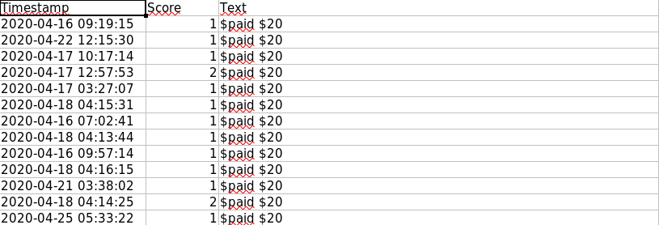

# Comment Searcher for Reddit
This script will search for one or more querys in a specific subreddit and save the mathing comments into an excel spreadsheet and a CSV file.

## 📦 Requirements
```
- Python 3
- Pip
```

## 🔧 Installation

You just need to install the dependencies, you can do that by running: `pip install -r requirements.txt`

## 🖥️ Usage

You'll need to open the _config.ini_ file and fill the fields with your client_id, client_secret, the subreddit you're searching and the querys. Something like this:

```
[DEFAULT]
SUBREDDIT = slavelabour
# Separate querys by a comma. Ex: QUERYS = python, reddit,programming
QUERYS = $paid

CLIENT_ID = YOUR_CLIENT_ID_HERE
CLIENT_SECRET = YOUR_CLIENT_SECRET_HERE

```

From there it's super easy, just run `python3.8 main.py` and the script will do the rest.

Once you do that, you'll see something like this:


The script will create a file called _comments.xlsx_ and another called _comments.csv_, both will look something like this:



## 📚 Dependencies

* [aiohttp](https://github.com/aio-libs/aiohttp): For asynchronous requests.
* [openpyxl](https://github.com/chronossc/openpyxl): For writing Excel files.