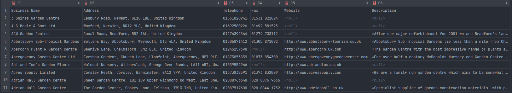

# HTA Scraper

This script will scrape [HTA](https://hta.org.uk/member-directory.html?primary_business_type=retailer) listings and write the next details into a CSV file:

* Business Name
* Address
* Telephone
* Fax
* Website
* Description

## 📦 Requirements
```
- Python 3
- Pip
```

## 🔧 Installation

You just need to install the dependencies, you can do that by running: `pip install -r requirements.txt`

## 🖥️ Usage

It's super easy, just run `python3.8 main.py` and the script will do the rest.

Once the scraping is finished, a file called `results.csv` will be created.

It's information will be structured like this:




## 📚 Dependencies

* [requests](https://docs.python-requests.org/en/master/): For doing GET requests.
* [Beautiful Soup](https://www.crummy.com/software/BeautifulSoup/bs4/doc/): For scraping the actual data.
