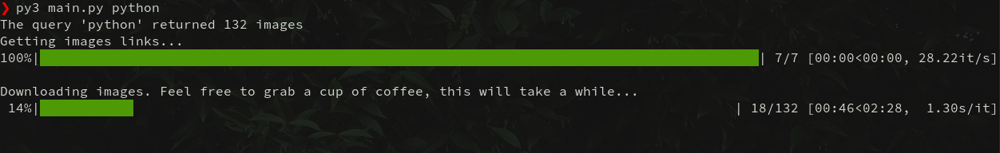

# Unplash Image Downloader

This script receives a query through the shell, and downloads every image found in [Unplash](https://unsplash.com/) in the maximum possible quality (raw). 

## 📦 Requirements
```
- Python 3
- Pip
```

## 🔧 Installation

You just need to install the dependencies, you can do that by running: `pip install -r requirements.txt`

## 🖥️ Usage

It's really quite simple, if I wanted to search for _python_ images, I'd run `python3.8 main.py python`

Once you do that, you'll see something like this:


The script will create a folder called _images_ and a subfolder with the same name of your query, like so:
```
.
├── main.py
├── images
│   ├── python
│   └── mountains
├── README.md
├── requirements.txt
```

## 📚 Dependencies

* [aiohttp](https://github.com/aio-libs/aiohttp): For asynchronous requests.
* [aiofiles](https://github.com/Tinche/aiofiles): For asynchronous downloads.
* [tqdm](https://github.com/tqdm/tqdm): For a simple and lightweight progressbar.
