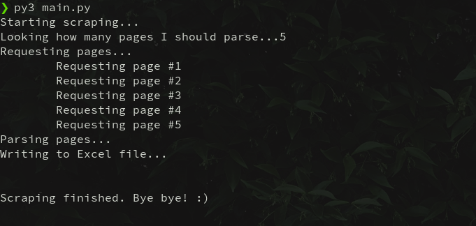

# Courses site

This script will scrape the courses data from [getWSOdowload](https://www.getwsodo.com/all-courses-table/) and insert it into an excel file.

## 📦 Requirements
```
- Python 3
- Pip
```

## 🔧 Installation

You just need to install the dependencies, you can do that by running: `pip install -r requirements.txt`

## 🖥️ Usage

It's super easy, just run `python3.8 main.py` and the script will do the rest.

Once you do that, you'll see something like this:


The script will create a file called _courses.xlsx_ which will look something like this:


## 📚 Dependencies

* [aiohttp](https://github.com/aio-libs/aiohttp): For asynchronous requests.
* [openpyxl](https://github.com/chronossc/openpyxl): For creating Excel files.
